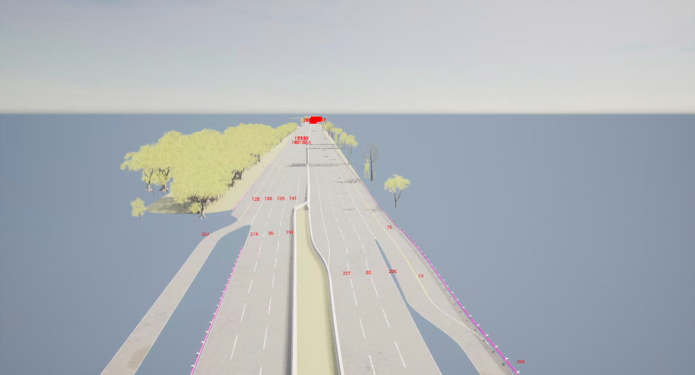
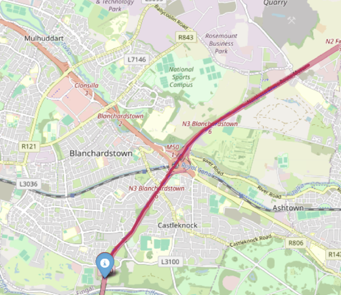
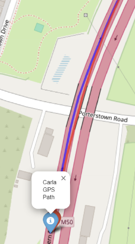

# M50 Motorway Map for CARLA

This repository provides an open-source HD map of Dublin's M50 motorway (Junction 5 to Junction 7) for use with the CARLA autonomous driving simulator. The digital map spans approximately 8.8 km and was developed as part of a research project validating CARLA's simulation fidelity against real-world sensor data.

---

##  Quick Start: Importing the M50 Map into CARLA

### Prerequisites

- CARLA (version 0.9.15 or later)
- The **standard CARLA build** (no need to build from source)
- Python 3.8
- A machine with:
  - 8 GB+ GPU (recommended)
  - 16 GB+ RAM
  - At least 10 GB free disk space

---

### Step-by-Step Instructions

1. **Download Map and Clone This Repository**:
   Download the map zip file for this map using this [link](https://www.dropbox.com/scl/fi/pl4b7duu8x7gw01uv6898/ScenerioHighwayFixed2_0.9.15.2-2-gb23c01ae4-dirty.tar.gz?rlkey=1vgo382xwkj6rh6yk75iiqqww&st=42jmf71f&dl=1) files is 1.2 GB too large for github.  should be named (e.g., `ScenerioHighwayFixed2_0.9.15.2-2-gb23c01ae4-dirty.tar`).

   ```bash
   git clone https://github.com/yourusername/m50-carla-map.git
   cd m50-carla-map
   ```
   

2. **Copy the ZIP File to CARLA's Import Folder**:

   Copy the provided ZIP file (e.g., `ScenerioHighwayFixed2_0.9.15.2-2-gb23c01ae4-dirty.tar`) into the `Import/` folder of your CARLA installation directory:


3. **Run the CARLA Import Script**:

   From the CARLA root directory, run the built-in import tool:

   ```bash
   ./ImportAssets.sh
   ```

   This unpacks and imports the map into your CARLA environment. The new map should now be available in the simulator. This may take a up to 2 hours to complete.

4. **Run CARLA and Load the M50 Map**:

   Start the simulator:

   ```bash
   ./CarlaUE4.sh
   ```

   Then use the map script prensent in the utils folder of the repo to see all maps loaded in the carla build (e.g., `ScenerioHighwayFixed2`) with your CARLA Python client:

   ```bash
   python3 listMaps.py
   ```

   ```bash
   cd PythonAPI/util
   python3 config.py --map <Name of Desired Map>
   ```

   This should change the map to the custom m50 map. This map was built using open street map data, and validated againt real GPS data to should projection of this Digital model of the M50 aligns with the real world M50.


---

## Screenshots


- 
- 
- 

---

## Reference

This map was developed and validated as part of, please reference according if used:

> **Conor Powderly (2025)**  
> _Towards Reliable AV Simulation in Ireland: Calibration and Real-World Validation of the CARLA Simulator on the M50_  
> Trinity College Dublin, School of Engineering

---

## 📜 License

This project is released under the MIT License. See the [LICENSE](LICENSE) file for more details.
